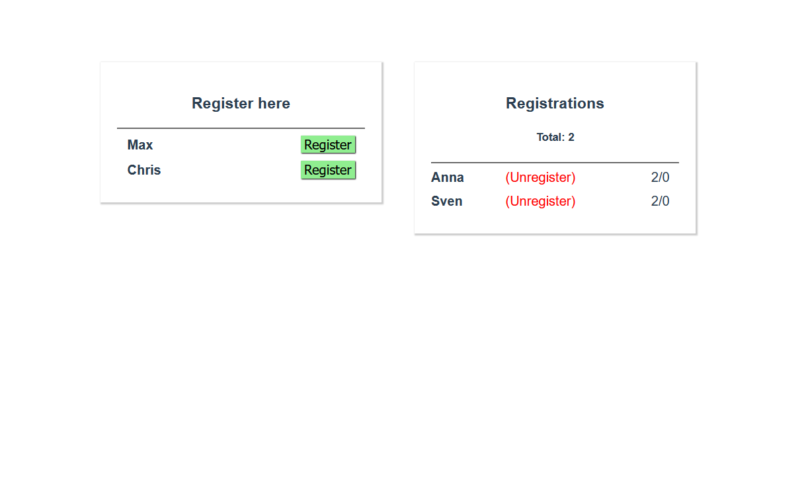

# Registration App
## Description

A small registration app using vuex's store

## Design



## Build Setup

```bash
# install dependencies
$ npm install

# serve with hot reload at localhost:8080
$ npm run serve
```

## Contribution

To contribute to this project please check out the [contribution guidelines](https://github.com/YurisCodingClub/accessibility-mentor/blob/main/CONTRIBUTING.md).